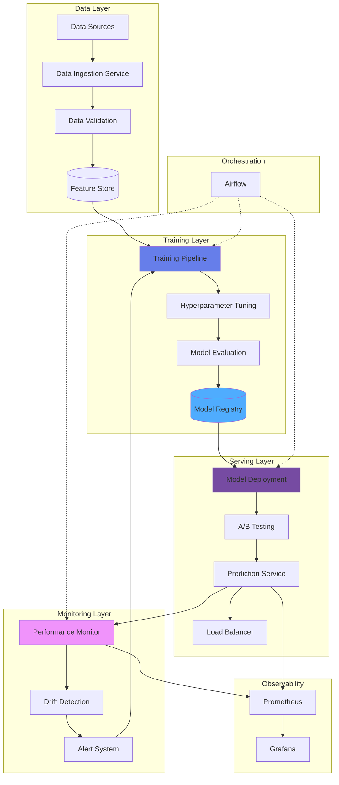

<div align="center">

# 🔧 MLOps Pipeline Framework

### *Production Machine Learning Operations Platform*

[](https://www.python.org/)
[](https://fastapi.tiangolo.com/)
[](https://mlflow.org/)
[](https://kubernetes.io/)
[](https://www.docker.com/)
[](LICENSE)

**[Live Demo](#) • [Documentation](#) • [API Docs](#) • [Report Bug](../../issues) • [Request Feature](../../issues)**

---

### 🎯 *End-to-end ML pipeline orchestration for production deployments*

Built with ❤️ by [Dev Suthar](https://github.com/devsuthar-ai) | ⭐ **Star us on GitHub!**

</div>

---

## 📋 Table of Contents

- [✨ Features](#-features)
- [🎬 Demo](#-demo)
- [🏗️ Architecture](#️-architecture)
- [🚀 Quick Start](#-quick-start)
- [📖 Documentation](#-documentation)
- [🔧 Pipeline Components](#-pipeline-components)
- [🧪 Model Training](#-model-training)
- [🚢 Model Deployment](#-model-deployment)
- [📊 Monitoring](#-monitoring)
- [🛠️ Tech Stack](#️-tech-stack)
- [🤝 Contributing](#-contributing)
- [📄 License](#-license)

---

## ✨ Features

<table>
<tr>
<td>

### 🎯 **Core Capabilities**
- 📊 **Data Pipeline** - Automated ingestion & validation
- 🤖 **Model Training** - Distributed training orchestration
- 🎯 **Hyperparameter Tuning** - Automated optimization
- 📈 **Experiment Tracking** - MLflow integration
- 🚀 **Model Deployment** - One-click deployment
- 📉 **Model Monitoring** - Real-time performance tracking

</td>
<td>

### 🛠️ **Technical Excellence**
- ☸️ **Kubernetes Native** - Auto-scaling & orchestration
- 🔄 **CI/CD Integration** - Automated ML workflows
- 📊 **Observability** - Prometheus + Grafana
- 🧪 **A/B Testing** - Model comparison
- 🔄 **Auto-Retraining** - Scheduled model updates
- 📦 **Model Registry** - Version management

</td>
</tr>
</table>

---

## 🎬 Demo

<div align="center">

### 🖼️ **Platform Screenshots**

<table>
<tr>
<td width="50%">

**📊 Pipeline Dashboard**


</td>
<td width="50%">

**📈 Model Tracking**


</td>
</tr>
<tr>
<td width="50%">

**🚀 Deployment Manager**


</td>
<td width="50%">

**📉 Performance Monitoring**


</td>
</tr>
</table>

</div>

---

## 🏗️ Architecture



### 📐 **System Components**

| Component | Technology | Purpose |
|-----------|-----------|---------|
| **Orchestration** | Airflow | Workflow management |
| **Experiment Tracking** | MLflow | Model versioning |
| **Model Serving** | FastAPI | High-performance API |
| **Feature Store** | Feast | Feature management |
| **Model Registry** | MLflow | Model storage |
| **Container Runtime** | Docker | Containerization |
| **Orchestration** | Kubernetes | Container orchestration |
| **Monitoring** | Prometheus + Grafana | Metrics & visualization |
| **Streaming** | Kafka | Real-time data |
| **Storage** | MinIO | Model artifacts |

---

## 🚀 Quick Start

### Prerequisites

```bash
# Required
- Python 3.11+
- Docker & Docker Compose
- Kubernetes cluster (optional)

# Optional for production
- MLflow server
- Airflow instance
- Prometheus + Grafana
```

### ⚡ One-Command Setup

```bash
# Clone repository
git clone https://github.com/devsuthar-ai/mlops-pipeline-framework.git
cd mlops-pipeline-framework

# Start all services
docker-compose up -d

# 🎉 Done! Access services:
# API: http://localhost:8001
# MLflow UI: http://localhost:5000
# Airflow UI: http://localhost:8080
# Grafana: http://localhost:3000
```

### 🐍 Local Development

```bash
# Create virtual environment
python -m venv venv
source venv/bin/activate  # Windows: venv\Scripts\activate

# Install dependencies
pip install -r requirements.txt

# Start API server
python src/main.py

# In new terminal, start MLflow
mlflow server --host 0.0.0.0 --port 5000

# In new terminal, start Airflow
airflow standalone
```

---

## 📖 Documentation

### 📚 **Complete Guides**

- [🏗️ Architecture Overview](docs/ARCHITECTURE.md)
- [📊 Data Pipeline Guide](docs/DATA_PIPELINE.md)
- [🤖 Model Training](docs/TRAINING.md)
- [🚀 Deployment Guide](docs/DEPLOYMENT.md)
- [📈 Monitoring & Alerts](docs/MONITORING.md)
- [🔧 Configuration](docs/CONFIGURATION.md)

---

## 🔧 Pipeline Components

### 📊 **1. Data Ingestion Pipeline**

```python
from src.data.ingestion import DataPipeline

# Initialize pipeline
pipeline = DataPipeline(
    source="s3://my-bucket/data",
    destination="feature_store",
    validation_rules={"schema": "v1.0"}
)

# Run ingestion
result = pipeline.ingest()
print(f"Ingested {result['rows']} rows")
```

**Features:**
- ✅ Multi-source support (S3, GCS, local, databases)
- ✅ Schema validation
- ✅ Data quality checks
- ✅ Incremental loading
- ✅ Error handling & retry logic

---

### 🤖 **2. Model Training Pipeline**

```python
from src.models.training import TrainingPipeline

# Configure training
config = {
    "model_type": "random_forest",
    "hyperparameters": {
        "n_estimators": 100,
        "max_depth": 10,
        "min_samples_split": 5
    },
    "training_data": "feature_store://train_v1",
    "validation_split": 0.2
}

# Initialize and run
pipeline = TrainingPipeline(config)
model = pipeline.train()

# Track with MLflow
pipeline.log_metrics({
    "accuracy": 0.95,
    "f1_score": 0.93,
    "training_time": 120.5
})
```

**Features:**
- ✅ Distributed training (PyTorch, TensorFlow)
- ✅ Automated hyperparameter tuning
- ✅ Cross-validation
- ✅ Early stopping
- ✅ Checkpointing
- ✅ MLflow integration

---

### 📈 **3. Model Evaluation**

```python
from src.models.evaluation import ModelEvaluator

# Evaluate model
evaluator = ModelEvaluator(model)
metrics = evaluator.evaluate(test_data)

print(f"""
Evaluation Results:
- Accuracy: {metrics['accuracy']:.3f}
- Precision: {metrics['precision']:.3f}
- Recall: {metrics['recall']:.3f}
- F1 Score: {metrics['f1']:.3f}
- AUC-ROC: {metrics['auc']:.3f}
""")

# Generate reports
evaluator.generate_report(output_path="reports/")
```

**Metrics Tracked:**
- Accuracy, Precision, Recall, F1
- ROC-AUC, PR-AUC
- Confusion Matrix
- Feature Importance
- Prediction Distribution

---

### 🚀 **4. Model Deployment**

```python
from src.serving.deployment import ModelDeployer

# Deploy model
deployer = ModelDeployer(
    model_uri="models:/production/RandomForest/v3",
    environment="production",
    replicas=3,
    resources={
        "cpu": "2",
        "memory": "4Gi"
    }
)

deployment = deployer.deploy()
print(f"Deployed at: {deployment['endpoint']}")

# Test endpoint
response = requests.post(
    deployment['endpoint'],
    json={"features": [1.2, 3.4, 5.6]}
)
print(f"Prediction: {response.json()['prediction']}")
```

**Deployment Features:**
- ✅ Rolling updates (zero downtime)
- ✅ Canary deployments
- ✅ A/B testing
- ✅ Auto-scaling
- ✅ Health checks
- ✅ Load balancing

---

### 📊 **5. Monitoring & Alerting**

```python
from src.monitoring.monitor import ModelMonitor

# Setup monitoring
monitor = ModelMonitor(
    model_name="RandomForest",
    metrics=["accuracy", "latency", "throughput"],
    alert_thresholds={
        "accuracy_drop": 0.05,
        "latency_p95": 500  # ms
    }
)

# Start monitoring
monitor.start()

# View dashboard
monitor.show_dashboard()
```

**Monitored Metrics:**
- Model performance (accuracy, F1, etc.)
- Prediction latency (p50, p95, p99)
- Throughput (predictions/sec)
- Resource usage (CPU, memory)
- Data drift detection
- Concept drift detection

---

## 🧪 Model Training

### Training Script Example

```python
# train.py
import mlflow
from sklearn.ensemble import RandomForestClassifier
from src.data import load_data
from src.models import train_model, evaluate_model

# Load data
X_train, y_train, X_test, y_test = load_data()

# Start MLflow run
with mlflow.start_run():
    # Train model
    model = RandomForestClassifier(
        n_estimators=100,
        max_depth=10,
        random_state=42
    )
    model.fit(X_train, y_train)
    
    # Evaluate
    metrics = evaluate_model(model, X_test, y_test)
    
    # Log to MLflow
    mlflow.log_params({
        "n_estimators": 100,
        "max_depth": 10
    })
    mlflow.log_metrics(metrics)
    mlflow.sklearn.log_model(model, "model")
    
    print(f"Model trained! Accuracy: {metrics['accuracy']:.3f}")
```

### Run Training

```bash
# Local training
python train.py

# Distributed training
python -m torch.distributed.launch train_distributed.py

# With Airflow
airflow dags trigger training_pipeline
```

---

## 🚢 Model Deployment

### Deployment Configuration

```yaml
# deployment.yaml
apiVersion: apps/v1
kind: Deployment
metadata:
  name: ml-model-serving
spec:
  replicas: 3
  selector:
    matchLabels:
      app: ml-model
  template:
    metadata:
      labels:
        app: ml-model
    spec:
      containers:
      - name: model-server
        image: ml-model:v1.0
        ports:
        - containerPort: 8001
        resources:
          requests:
            memory: "2Gi"
            cpu: "1"
          limits:
            memory: "4Gi"
            cpu: "2"
        env:
        - name: MODEL_URI
          value: "models:/production/latest"
```

### Deploy to Kubernetes

```bash
# Apply deployment
kubectl apply -f deployment.yaml

# Check status
kubectl get pods -l app=ml-model

# Expose service
kubectl expose deployment ml-model-serving --type=LoadBalancer --port=80 --target-port=8001

# Get endpoint
kubectl get svc ml-model-serving
```

---

## 📊 Monitoring

### Prometheus Metrics

```python
from prometheus_client import Counter, Histogram, Gauge

# Define metrics
prediction_counter = Counter(
    'model_predictions_total',
    'Total predictions made'
)

prediction_latency = Histogram(
    'model_prediction_latency_seconds',
    'Prediction latency'
)

model_accuracy = Gauge(
    'model_accuracy',
    'Current model accuracy'
)

# Use in code
@prediction_latency.time()
def predict(features):
    prediction_counter.inc()
    result = model.predict(features)
    return result
```

### Grafana Dashboards

Access dashboards at `http://localhost:3000`

**Available Dashboards:**
1. **Model Performance**
   - Accuracy over time
   - Precision/Recall trends
   - Confusion matrix heatmap

2. **System Metrics**
   - CPU/Memory usage
   - Request rate
   - Error rate

3. **Prediction Analytics**
   - Latency distribution
   - Throughput
   - Feature distribution

4. **Data Drift**
   - Feature drift detection
   - Concept drift alerts
   - Distribution changes

---

## 🛠️ Tech Stack

<div align="center">

### **ML & Data**


### **MLOps Tools**


### **Infrastructure**


### **API & Serving**


</div>

---

## 📁 Project Structure

```
mlops-pipeline-framework/
├── src/
│   ├── data/                    # Data pipelines
│   │   ├── ingestion/          # Data ingestion
│   │   ├── preprocessing/      # Data preprocessing
│   │   └── validation/         # Data validation
│   ├── models/                  # Model code
│   │   ├── training/           # Training logic
│   │   ├── evaluation/         # Evaluation
│   │   └── registry/           # Model registry
│   ├── serving/                 # Model serving
│   │   ├── api/               # FastAPI endpoints
│   │   ├── batch/             # Batch inference
│   │   └── streaming/         # Stream processing
│   ├── monitoring/             # Monitoring
│   │   ├── metrics.py         # Metrics collection
│   │   └── alerts.py          # Alert rules
│   └── orchestration/          # Workflow orchestration
│       └── dags/              # Airflow DAGs
├── pipelines/                  # Pipeline definitions
│   ├── training_pipeline.py   # Training workflow
│   ├── inference_pipeline.py  # Inference workflow
│   └── retraining_pipeline.py # Auto-retraining
├── tests/                      # Tests
│   ├── unit/                  # Unit tests
│   ├── integration/           # Integration tests
│   └── e2e/                   # End-to-end tests
├── configs/                    # Configuration files
│   ├── model_config.yaml      # Model configs
│   ├── pipeline_config.yaml   # Pipeline configs
│   └── deployment_config.yaml # Deployment configs
├── deployments/                # Deployment manifests
│   ├── kubernetes/            # K8s manifests
│   └── docker/                # Docker configs
├── docs/                       # Documentation
├── monitoring/                 # Monitoring configs
│   ├── prometheus/            # Prometheus setup
│   └── grafana/              # Grafana dashboards
├── scripts/                    # Utility scripts
├── main.py                     # Application entry
├── requirements.txt           # Dependencies
└── README.md                  # This file
```

---

## 🚀 Usage Examples

### Complete ML Pipeline

```python
from src.pipeline import MLPipeline

# Initialize pipeline
pipeline = MLPipeline(
    name="fraud_detection",
    config_path="configs/fraud_model.yaml"
)

# Run full pipeline
results = pipeline.run(
    data_source="s3://data/transactions.csv",
    experiment_name="fraud_detection_v2"
)

print(f"""
Pipeline Results:
- Model: {results['model_uri']}
- Accuracy: {results['metrics']['accuracy']:.3f}
- Deployment: {results['deployment']['endpoint']}
""")
```

### Batch Inference

```python
from src.serving.batch import BatchPredictor

# Initialize predictor
predictor = BatchPredictor(
    model_uri="models:/production/fraud_model/latest"
)

# Run batch predictions
predictions = predictor.predict_batch(
    input_path="s3://data/new_transactions.csv",
    output_path="s3://predictions/results.csv"
)

print(f"Processed {len(predictions)} predictions")
```

### Real-time Serving

```python
from fastapi import FastAPI
from src.serving import ModelServer

app = FastAPI()
model_server = ModelServer("models:/production/latest")

@app.post("/predict")
async def predict(features: dict):
    prediction = model_server.predict(features)
    return {
        "prediction": prediction,
        "model_version": model_server.version,
        "latency_ms": model_server.last_latency
    }
```

---

## 📊 Performance

### Benchmarks

| Metric | Value | Target |
|--------|-------|--------|
| **Training Time** | 15 min | < 20 min |
| **Inference Latency (p50)** | 25ms | < 50ms |
| **Inference Latency (p95)** | 45ms | < 100ms |
| **Throughput** | 2000 pred/sec | > 1000 pred/sec |
| **Model Accuracy** | 96.5% | > 95% |
| **Deployment Time** | 2 min | < 5 min |

---

## 🤝 Contributing

Contributions welcome! See [CONTRIBUTING.md](CONTRIBUTING.md) for guidelines.

---

## 📄 License

MIT License - see [LICENSE](LICENSE) file.

---

## 📞 Contact

<div align="center">

[](https://github.com/devsuthar-ai)
[](https://linkedin.com/in/devsuthar)
[](mailto:dev.suthar@example.com)

---

**Made with ❤️ by Dev Suthar**

*Building production ML systems at scale*

⭐ **Star this repo if you find it helpful!**

</div>
